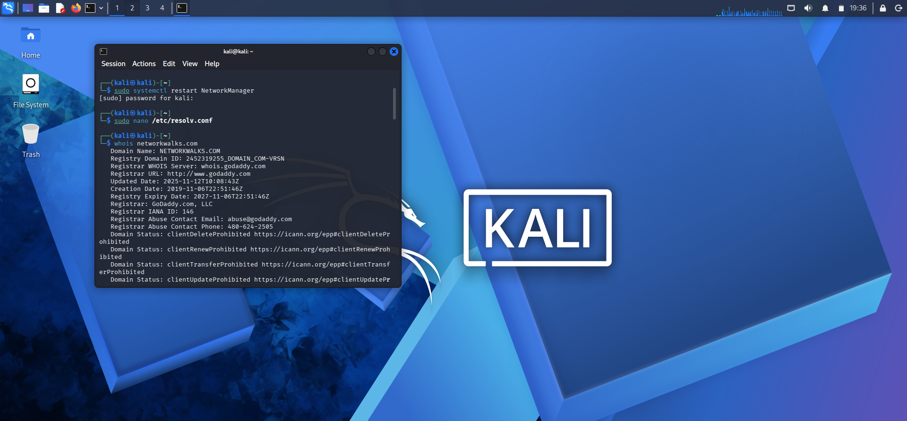
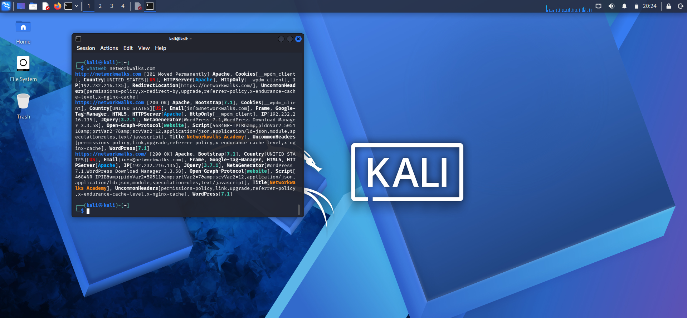
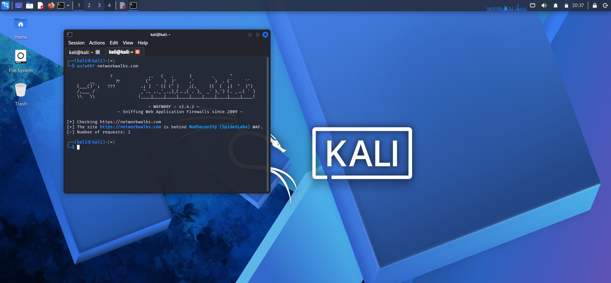
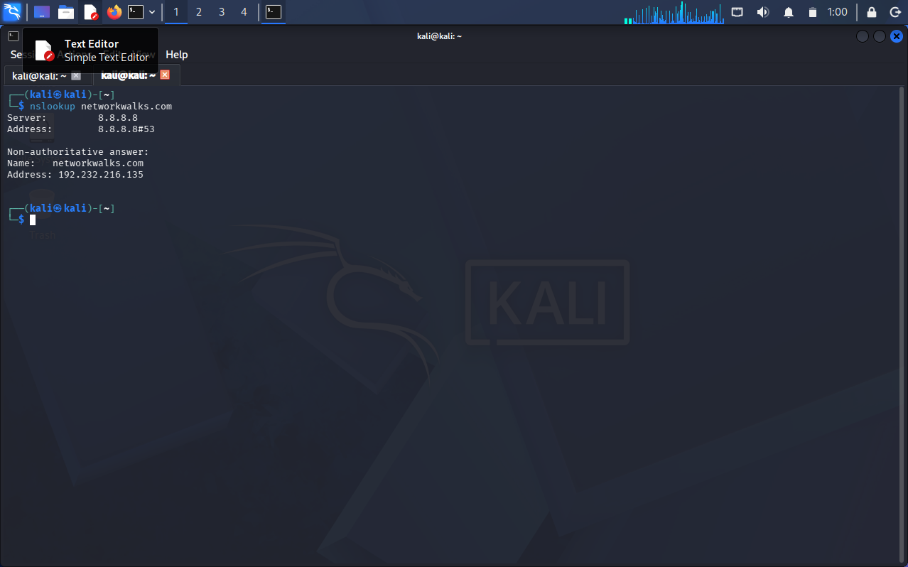
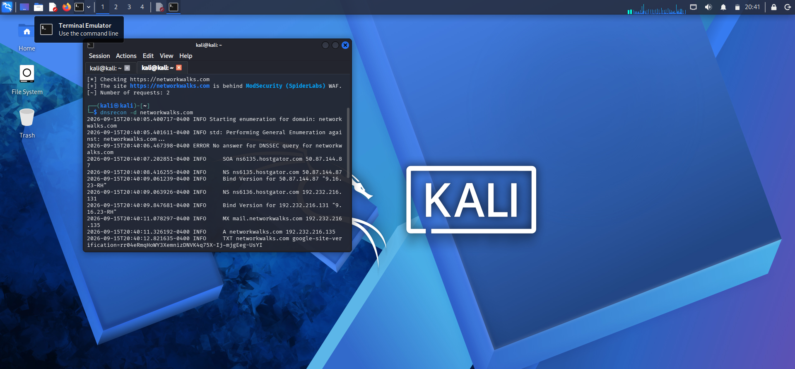
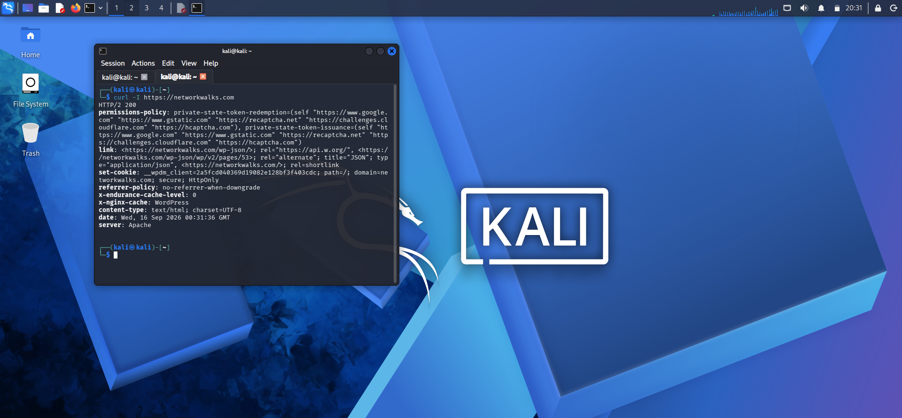

Project Report: Footprinting, Reconnaissance, and Network Scanning

Course/Module: Cybersecurity & Ethical Hacking – Week 2

Author: [Esther Mesirionye] 

Program Batch: B083-Networkwalks 

Date: 17, September,2026 

Modules Completed: PM1 [Footprinting and Reconnaissance Attack with Multiple Kali tools]
PM2 [Network Scanning with Zenmap] 

                                       EXECUTIVE SUMMARY
This report documents the active and passive reconnaissance and network scanning activities conducted during Week 2. The primary objective was to demonstrate practical techniques for gathering target intelligence, identifying web application technologies, mapping DNS infrastructure, and auditing local network environments for active live hosts using industry-standard penetration testing tools.

Part 1: Information Gathering & Reconnaissance Passive and active footprinting was performed against target environments using multiple tools within Kali Linux to collect critical metadata prior to active network probing 

.1. Domain Registration & Ownership Analysis (whois) 

Objective: Gather registrar details, registration/expiration dates, domain ownership records, and name servers.

Execution:

Key Findings:Identified domain registrar information and active status.Retrieved contact handles and authoritative domain name servers

.2. Web Technology Fingerprinting (whatweb)

Objective: Identify technologies running on the target web server, including CMS platforms, web servers, embedded scripts, and content delivery networks.

Execution:

Key Findings:Detected target web server type, engine version, and scripting headers.Mapped web application components without impacting server availability

.3. Web Application Firewall Detection (wafw00f)

Objective: Determine if a Web Application Firewall (WAF) or Reverse Proxy (e.g., Cloudflare, AWS WAF, Imperva) is protecting the target web application.

Execution:

Key Findings:Identified whether active filtering engines are monitoring incoming web traffic.Determined firewall bypass or direct-access considerations for further security testing.

4. DNS Infrastructure & Resolution Analysis (nslookup & dnsrecon)
  
Objective: Perform query resolution and automated enumeration of subdomains, mail servers, and zone transfer records.

Execution:
 

# Comprehensive DNS Enumeration

Key Findings:Mapped Primary IPv4/IPv6 address records (A/AAAA).Identified Mail Exchange (MX), Name Server (NS), and Text (TXT) records for SPF/DKIM verification.

HTTP Header Analysis & Inspection (curl)

Objective: Fetch and inspect HTTP request/response headers directly from the web application to check for misconfigurations or missing security headers.

Execution:

Key Findings:Checked HTTP response codes (200 OK, 301 Moved Permanently, etc.).Inspected response headers (Server, X-Powered-By, Strict-Transport-Security, X-Frame-Options).

Part 2: Network Scanning with Zenmap / NmapUsing the official Nmap graphical interface (Zenmap), network host discovery was performed to discover live systems on the local area network (LAN).

1. Environment & Local IP Identification
 Objective: Locate local network configuration parameters, IP address, and subnet.

Configuration:Local IP Address: 10.0.0.5Subnet: 10.0.0.0/24

2. Host Discovery (Ping Scan)Scan Type: Ping Scan (nmap -sn 10.0.0.0/24)

Target Subnet: 10.0.0.0/24

Objective: Send ICMP Echo requests and ARP requests to discover online systems within the subnet.

3. Scan Findings & Results Total Live Hosts Discovered:

 
 
4. HostsHost Name / TypeIP AddressMAC AddressGateway / Router10.0.0.100:50:56:E3:B3:2C
 
 Target Host 110.0.0.400:0C:29:C0:94:8F
 
 Target Host 210.0.0.1900:50:56:E9:64:82
 
 Local Workstation (Host)10.0.0.500-0C-29-40-C0-934.
 
 Network Topology & Deliverables Topology Generation: In Zenmap, selected the Topology view, activated the graphic legend, and verified node links for discovered IPs.
 
 Exporting Results: Saved the output graphic in PDF format on the desktop as  Network_Topology.pnd for inclusion in project compliance artifacts.
 
 
 
 

 
 
 Part 3: Challenges Encountered & Solutions
 
 

 
During the execution of the lab modules, several operational and technical challenges arose, Below is a summary of these obstacles and how they were resolved

Locating the Local IP Address

Challenge: Identifying the exact IP address and subnet mask required for the scan target was initially confusing.

Resolution: Executed command-line Network diagnostics (ipconfig /all on Windows / ifconfig or ip a on Linux) to isolate the IPv4 address and calculate the local /24 CIDR block.

Network Connectivity & Bridging Issues with Kali Linux

Challenge: During the initial network scanning phase, host discovery scans returned incomplete results or timed out because the host environment was not properly connected to the Kali Linux virtual network interface.

Resolution: Reconfigured the Virtual Machine network adapter settings from NAT/Host-Only to Bridged Mode (or ensuring both systems shared the identical virtual subnet), allowing Kali to directly communicate with the local network interface.Command Syntax Errors & Troubleshooting

Challenge: Syntax errors were encountered while executing specific CLI footprinting and scanning tools (whois, wafw00f, dnsrecon, curl), leading to failed queries or unhandled parameter flags.

Resolution: Carefully reviewed error messages, cross-referenced tool options using help flags (--help or man), and stepped back through prior steps to correct typos in arguments, domain formats, and flag sequences.

Conclusion & Security Recommendations

Reconnaissance Countermeasures: Limit information disclosure by obfuscating web server banners, concealing domain administrative details via Whois privacy, and disabling detailed HTTP default response headers.

Network Monitoring: Implement ARP spoofing detection and restrict unauthorized network discovery by filtering ICMP echo responses on internal host firewalls were practical.
